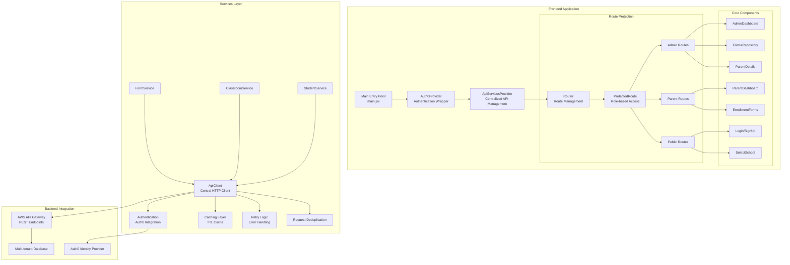
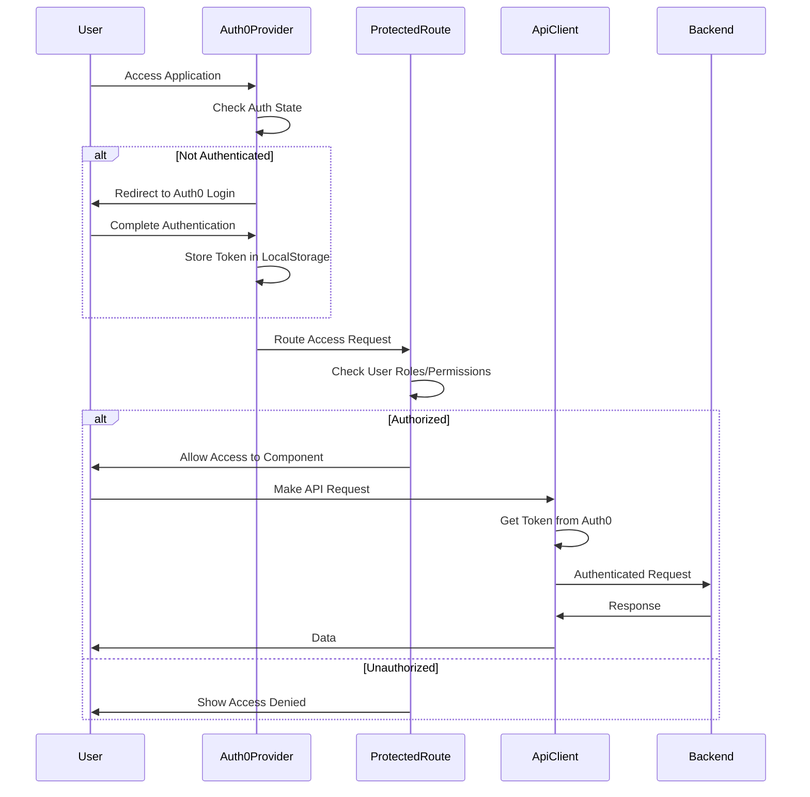
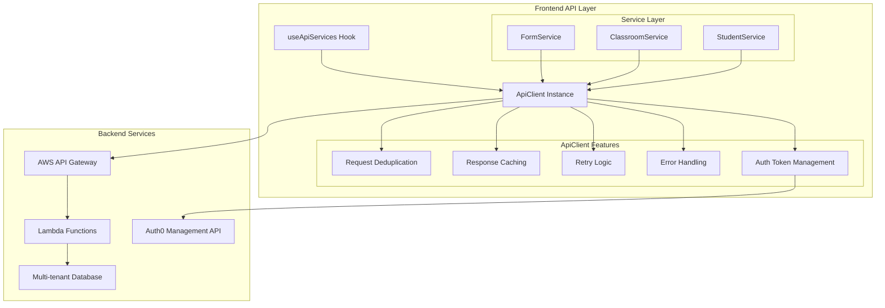
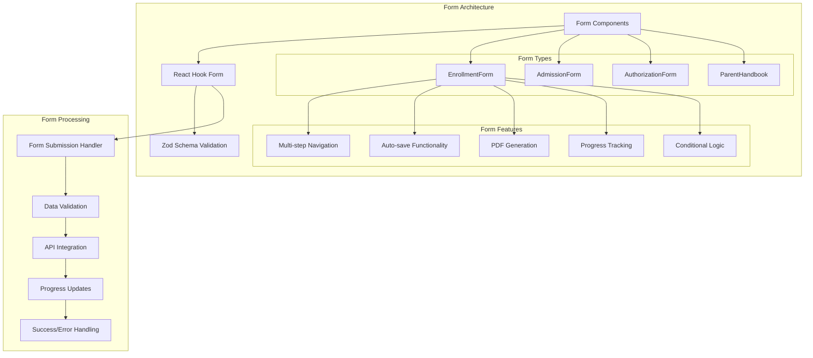
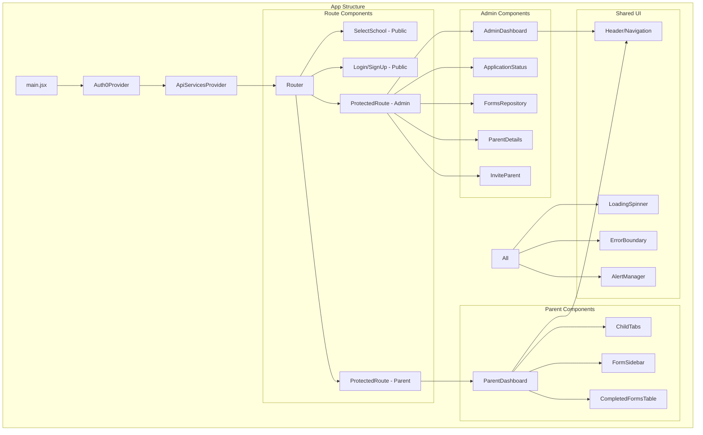
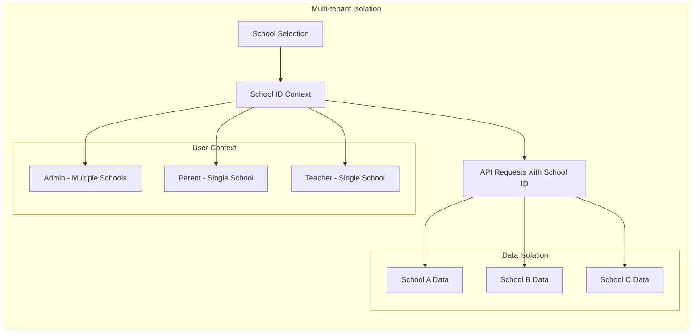
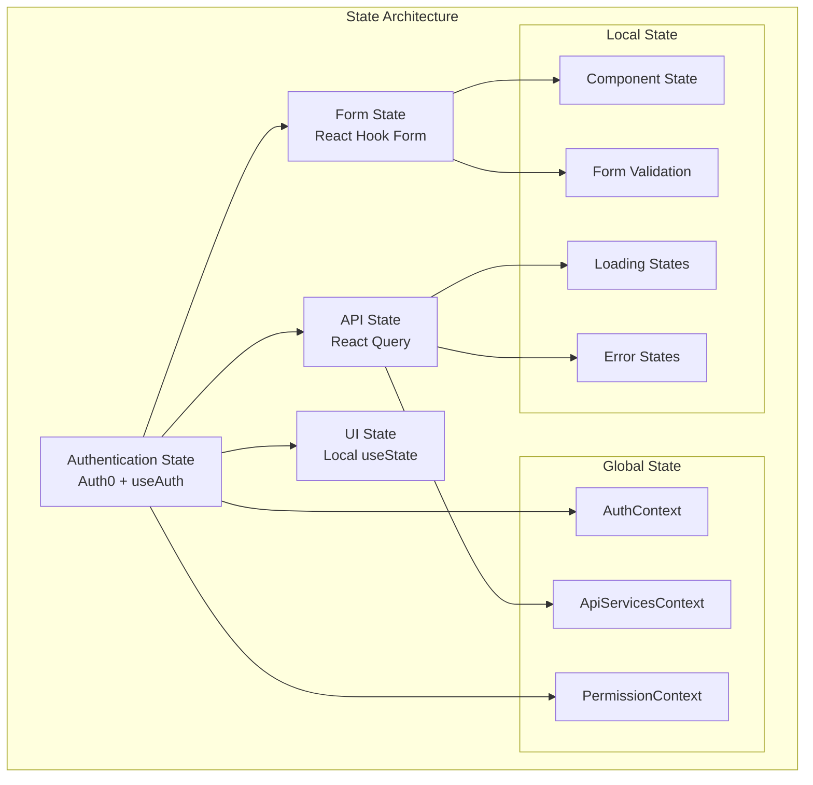
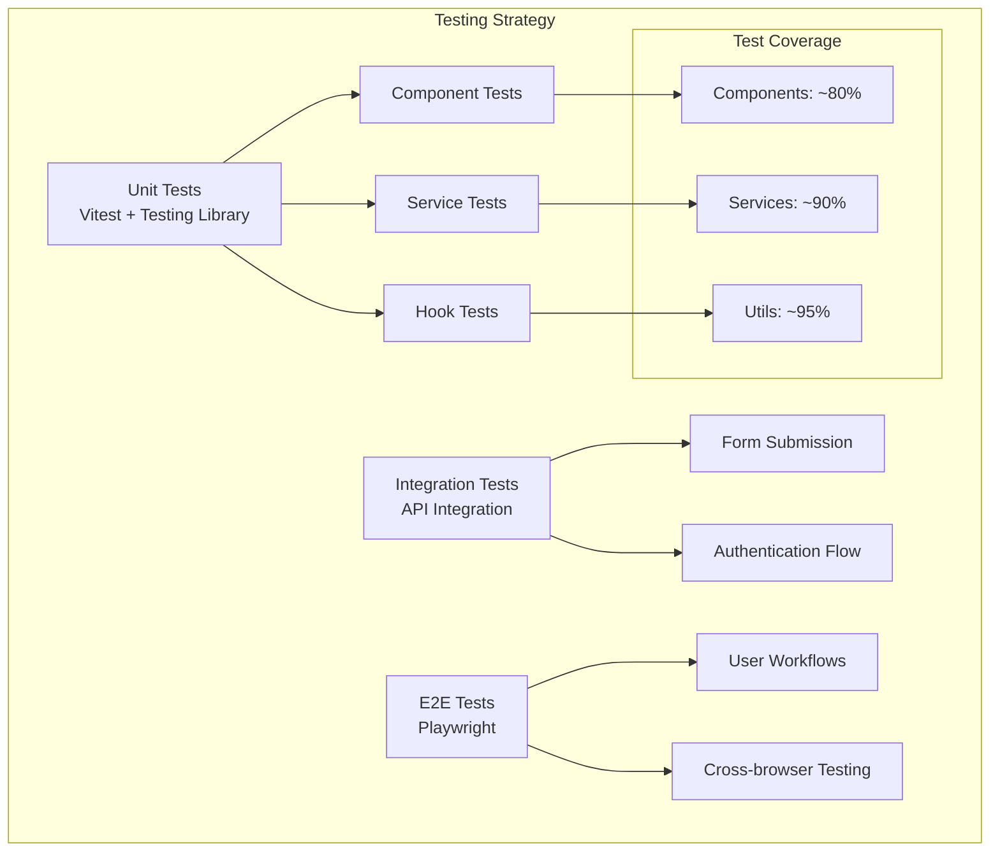

# Goddard React Application - Codebase Architecture

## Overview

The Goddard React application is a multi-tenant educational management system built with React 19, featuring Auth0 authentication, role-based access control, and comprehensive form management for parent enrollment and school administration.

## Technology Stack

### Core Technologies
- **Frontend**: React 19.1.0 with Vite
- **Routing**: React Router DOM 7.6.3
- **Authentication**: Auth0 React 2.4.0
- **State Management**: React Hook Form 7.62.0 with Zod validation
- **UI Components**: Radix UI primitives with Tailwind CSS
- **Data Fetching**: TanStack React Query 5.85.5
- **Testing**: Vitest 3.2.4, Playwright 1.55.0, Testing Library

### Key Features
- Multi-tenant architecture with school isolation
- Role-based access control (Admin, Parent, Teacher)
- Comprehensive form management system
- Advanced API client with caching, retries, and deduplication
- Real-time authentication state management
- PDF generation and export capabilities
- Progressive web app features

## System Architecture



## Directory Structure Analysis

### Root Structure
```
goddard-react/
├── src/                    # Source code
├── tests/                  # Test infrastructure
├── docs/                   # Documentation
├── public/                 # Static assets
├── dist/                   # Build output
└── config files           # Package.json, vite.config, etc.
```

### Source Code Organization

```mermaid
graph TD
    A[src/] --> B[components/]
    A --> C[services/]
    A --> D[hooks/]
    A --> E[utils/]
    A --> F[contexts/]
    A --> G[parentComponent/]
    
    B --> B1[ui/ - Reusable UI Components]
    B --> B2[common/ - Shared Components]
    B --> B3[dashboard/ - Dashboard Components]
    B --> B4[optimized/ - Performance Optimized]
    
    C --> C1[api/ - API Services]
    C --> C2[auth/ - Authentication]
    C --> C3[permissions/ - Access Control]
    C --> C4[cache/ - Caching Logic]
    
    D --> D1[useAuth - Authentication Hook]
    D --> D2[useApiData - Data Fetching]
    D --> D3[usePermissions - Access Control]
    
    E --> E1[auth.js - Auth Utilities]
    E --> E2[formSubmission.js - Form Logic]
    E --> E3[errorHandler.js - Error Management]
    
    G --> G1[forms/ - Complex Form Components]
    G --> G2[pdf_forms/ - PDF Generation]
```



## Authentication & Authorization Flow



## API Architecture



## Form Management System



## Component Hierarchy



## Multi-tenant Architecture



## State Management



## Testing Architecture



## Key Architectural Patterns

### 1. Service Layer Pattern
- Centralized API client with service abstraction
- Dependency injection through React Context
- Separation of concerns between UI and data logic

### 2. Protected Route Pattern
- Role-based access control
- Route-level authentication checks
- Flexible permission system

### 3. Form Management Pattern
- Multi-step form navigation
- Centralized validation with Zod schemas
- Auto-save and progress tracking

### 4. Error Boundary Pattern
- Graceful error handling
- Fallback UI components
- Error reporting and recovery

### 5. Multi-tenant Pattern
- School-based data isolation
- Context-aware API requests
- Role-based access per tenant

## Performance Optimizations

1. **Request Deduplication**: Prevents duplicate concurrent API calls
2. **Response Caching**: TTL-based caching for GET requests
3. **Code Splitting**: Route-based lazy loading
4. **Optimized Re-renders**: Memoization and selective updates
5. **Progressive Loading**: Skeleton screens and loading states

## Security Considerations

1. **Authentication**: Auth0 integration with secure token management
2. **Authorization**: Fine-grained role and permission checks
3. **HTTPS**: All API communications encrypted
4. **Token Refresh**: Automatic token refresh handling
5. **XSS Protection**: Input sanitization and validation
6. **CSRF Protection**: Token-based request authentication

## Deployment Architecture

The application is designed for cloud deployment with:
- Static hosting (Vite build output)
- CDN distribution for assets
- Environment-based configuration
- CI/CD pipeline integration
- Multi-environment support (dev, staging, prod)

This architecture provides a scalable, maintainable, and secure foundation for the Goddard Schools management system.