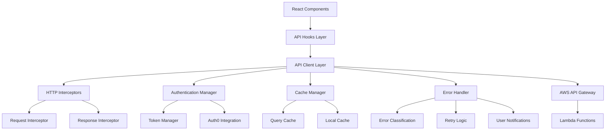

# API Architecture Analysis & Design

## Executive Summary

This document presents a comprehensive analysis of the current Goddard React application's API architecture and proposes a centralized, type-safe, and maintainable API service architecture to improve developer experience, reliability, and performance.

## Current State Analysis

### API Patterns Identified

#### 1. Authentication Layer (Auth0 Integration)
**Current Implementation:**
- Auth0Provider wrapper with environment configuration
- Custom hooks for Auth0 integration (`useAuth0`)
- Token management utilities in `utils/auth.js`
- Multiple authentication contexts (`AuthContext.tsx`, `Auth0Provider.jsx`)

**Strengths:**
- Well-structured Auth0 integration
- Comprehensive token management utilities
- Good error handling with retry logic
- Proper localStorage persistence

**Issues:**
- Duplicate authentication contexts
- Inconsistent token request patterns
- Mixed authentication approaches (Auth0Provider vs AuthContext)

#### 2. API Communication Patterns
**Current Implementation:**
- Direct `fetch` calls with manual header management
- Custom authentication wrappers (`getAuthHeaders`, `authenticatedFetch`)
- Mixed endpoint configurations (hardcoded URLs, environment variables)
- Inconsistent error handling across components

**Code Example:**
```javascript
// Current pattern in formSubmission.js
const headers = await getAuthHeaders(getAccessTokenSilently);
const response = await fetch(`${api_base_url}${endpointConfig.url}`, {
  method: endpointConfig.method,
  headers,
  body: JSON.stringify(formData)
});
```

**Issues:**
- No centralized API client
- Repetitive header management
- Inconsistent error handling
- No request/response interceptors
- No standardized caching
- Mixed success/error response patterns

#### 3. Data Management Patterns
**Current Implementation:**
- Custom hooks for data fetching (`useParentData`)
- Service classes (`UnifiedParentService`)
- Multiple caching layers (`multiLayerCache.js`)
- Component-level state management

**Strengths:**
- Unified data fetching in `useParentData`
- Good caching strategy in services
- Proper data transformation

**Issues:**
- No React Query/TanStack Query integration (available but unused)
- Mixed data management patterns
- Complex caching logic
- No standardized loading states

#### 4. Error Handling
**Current Implementation:**
- Custom error categorization (`errorHandler.js`)
- Retry logic with exponential backoff
- User-friendly error messages
- API diagnostics utilities (`apiDiagnostics.js`)

**Strengths:**
- Comprehensive error categorization
- Good retry strategies
- Diagnostic utilities for debugging

**Issues:**
- Scattered error handling logic
- No centralized error reporting
- Inconsistent error UI patterns

## Proposed API Architecture

### Architecture Overview



### Core Components

#### 1. Centralized API Client
**Design Principles:**
- Type-safe interfaces using TypeScript
- Automatic request/response transformation
- Built-in authentication handling
- Comprehensive error management
- Configurable retry logic

**Implementation Pattern:**
```typescript
// api/client.ts
class APIClient {
  private baseURL: string;
  private authManager: AuthenticationManager;
  private cacheManager: CacheManager;
  private errorHandler: ErrorHandler;

  async request<T>(config: RequestConfig): Promise<APIResponse<T>> {
    // Pre-request interceptors
    // Authentication injection
    // Request execution
    // Response processing
    // Error handling
    // Caching logic
  }
}
```

#### 2. Authentication Manager
**Responsibilities:**
- Token acquisition and refresh
- Request header injection
- Authentication state management
- Session monitoring

**Interface:**
```typescript
interface AuthenticationManager {
  getToken(): Promise<string | null>;
  refreshToken(): Promise<string | null>;
  injectHeaders(headers: HeadersInit): Promise<HeadersInit>;
  isAuthenticated(): Promise<boolean>;
  logout(): Promise<void>;
}
```

#### 3. Standardized Error Handling
**Error Classification System:**
```typescript
enum APIErrorType {
  NETWORK = 'NETWORK',
  AUTHENTICATION = 'AUTHENTICATION',
  AUTHORIZATION = 'AUTHORIZATION',
  VALIDATION = 'VALIDATION',
  SERVER = 'SERVER',
  TIMEOUT = 'TIMEOUT',
  UNKNOWN = 'UNKNOWN'
}

interface APIError {
  type: APIErrorType;
  message: string;
  statusCode?: number;
  originalError?: Error;
  retryable: boolean;
  userMessage: string;
}
```

#### 4. React Query Integration
**Benefits:**
- Automatic caching and synchronization
- Background updates
- Optimistic updates
- Pagination support
- Offline support

**Hook Pattern:**
```typescript
// hooks/api/useParentDashboard.ts
export const useParentDashboard = (email: string) => {
  return useQuery({
    queryKey: ['parentDashboard', email],
    queryFn: () => apiClient.getParentDashboard(email),
    staleTime: 5 * 60 * 1000, // 5 minutes
    cacheTime: 10 * 60 * 1000, // 10 minutes
    retry: (failureCount, error) => {
      return shouldRetry(error) && failureCount < 3;
    }
  });
};
```

### Type System Design

#### API Response Types
```typescript
// types/api.ts
interface APIResponse<T> {
  data: T;
  status: number;
  message?: string;
  timestamp: string;
  requestId: string;
}

interface PaginatedResponse<T> extends APIResponse<T[]> {
  pagination: {
    page: number;
    limit: number;
    total: number;
    hasNext: boolean;
  };
}

// Domain Types
interface Child {
  id: number;
  firstName: string;
  lastName: string;
  className: string;
  formData: Record<string, any>;
  completedForms: CompletedForm[];
  incompleteForms: string[];
  stats: FormStats;
}

interface ParentDashboard {
  parentName: string;
  children: Child[];
  overallStats: OverallStats;
}
```

#### Endpoint Configuration
```typescript
// api/endpoints.ts
interface EndpointConfig {
  method: 'GET' | 'POST' | 'PUT' | 'DELETE' | 'PATCH';
  url: string;
  requiresAuth: boolean;
  timeout?: number;
  retryConfig?: RetryConfig;
  cacheConfig?: CacheConfig;
}

const ENDPOINTS = {
  PARENT_DASHBOARD: {
    method: 'GET',
    url: '/admission_child_personal/parent_email/{schoolId}/{email}',
    requiresAuth: true,
    timeout: 10000,
    cacheConfig: { ttl: 300000 }
  },
  SUBMIT_FORM: {
    method: 'PUT',
    url: '/{formType}/{schoolId}/{childId}',
    requiresAuth: true,
    timeout: 15000
  }
} as const;
```

## Caching Strategy

### Multi-Layer Caching Architecture

#### 1. React Query Cache (In-Memory)
- **Purpose**: Component-level data caching
- **TTL**: 5-10 minutes for dashboard data
- **Invalidation**: Manual and automatic
- **Features**: Background refresh, stale-while-revalidate

#### 2. Browser Cache (SessionStorage/LocalStorage)
- **Purpose**: Cross-tab synchronization and offline support
- **Data**: Non-sensitive, transformed data only
- **TTL**: Session-based or 24 hours
- **Encryption**: For sensitive data

#### 3. HTTP Cache (Browser)
- **Purpose**: Network-level caching
- **Headers**: `Cache-Control`, `ETag`, `Last-Modified`
- **Strategy**: Cache-first for static assets, network-first for dynamic data

### Cache Invalidation Strategy
```typescript
// cache/manager.ts
class CacheManager {
  async invalidate(patterns: string[]): Promise<void> {
    // Invalidate React Query cache
    await queryClient.invalidateQueries({ queryKey: patterns });
    
    // Clear browser storage
    patterns.forEach(pattern => {
      sessionStorage.removeItem(pattern);
      localStorage.removeItem(pattern);
    });
  }

  async invalidateOnFormSubmission(childId: number): Promise<void> {
    const patterns = [
      ['parentDashboard'],
      ['child', childId],
      ['forms', childId]
    ];
    
    await this.invalidate(patterns);
  }
}
```

## Loading State Management

### Unified Loading States
```typescript
// types/ui.ts
interface LoadingState {
  isLoading: boolean;
  isRefreshing: boolean;
  isLoadingMore: boolean;
  error: APIError | null;
  lastUpdated: Date | null;
}

// hooks/useLoadingState.ts
export const useLoadingState = () => {
  const [state, setState] = useState<LoadingState>({
    isLoading: false,
    isRefreshing: false,
    isLoadingMore: false,
    error: null,
    lastUpdated: null
  });

  return {
    ...state,
    setLoading: (loading: boolean) => setState(s => ({ ...s, isLoading: loading })),
    setRefreshing: (refreshing: boolean) => setState(s => ({ ...s, isRefreshing: refreshing })),
    setError: (error: APIError | null) => setState(s => ({ ...s, error })),
    setLastUpdated: () => setState(s => ({ ...s, lastUpdated: new Date() }))
  };
};
```

### Loading UI Components
```typescript
// components/LoadingStates.tsx
export const LoadingSpinner: FC<{ size?: 'sm' | 'md' | 'lg' }> = ({ size = 'md' }) => (
  <div className={`animate-spin rounded-full border-b-2 border-primary ${sizeClasses[size]}`} />
);

export const LoadingCard: FC<{ children: ReactNode }> = ({ children }) => (
  <Card className="animate-pulse">
    <CardContent className="p-8 text-center">
      <LoadingSpinner size="lg" />
      <div className="mt-4">{children}</div>
    </CardContent>
  </Card>
);

export const DataTableSkeleton: FC<{ rows?: number }> = ({ rows = 5 }) => (
  <div className="space-y-2">
    {Array.from({ length: rows }).map((_, i) => (
      <div key={i} className="h-12 bg-gray-200 rounded animate-pulse" />
    ))}
  </div>
);
```

## Request/Response Interceptors

### Request Interceptor
```typescript
// api/interceptors/request.ts
export const requestInterceptor: RequestInterceptor = async (config) => {
  // Add authentication headers
  const authHeaders = await authManager.getHeaders();
  config.headers = { ...config.headers, ...authHeaders };

  // Add request ID for tracking
  config.headers['X-Request-ID'] = generateRequestId();

  // Add timestamp
  config.headers['X-Request-Time'] = new Date().toISOString();

  // Log request in development
  if (import.meta.env.DEV) {
    console.log(`🌐 [API] ${config.method} ${config.url}`, config);
  }

  return config;
};
```

### Response Interceptor
```typescript
// api/interceptors/response.ts
export const responseInterceptor: ResponseInterceptor = async (response, config) => {
  // Log response in development
  if (import.meta.env.DEV) {
    console.log(`📡 [API] ${response.status} ${config.url}`, response);
  }

  // Handle authentication errors globally
  if (response.status === 401) {
    await authManager.handleAuthError();
    throw new APIError(APIErrorType.AUTHENTICATION, 'Authentication required');
  }

  // Transform response data
  const data = await response.json();
  
  return {
    data,
    status: response.status,
    headers: response.headers,
    config
  };
};
```

## API Testing & Diagnostics

### Testing Framework
```typescript
// api/__tests__/client.test.ts
describe('API Client', () => {
  beforeEach(() => {
    vi.clearAllMocks();
    setupMockServer();
  });

  it('should handle authentication automatically', async () => {
    const mockToken = 'mock-token';
    authManager.getToken.mockResolvedValue(mockToken);

    await apiClient.get('/test-endpoint');

    expect(fetch).toHaveBeenCalledWith(
      expect.any(String),
      expect.objectContaining({
        headers: expect.objectContaining({
          'Authorization': `Bearer ${mockToken}`
        })
      })
    );
  });

  it('should retry failed requests', async () => {
    fetch
      .mockRejectedValueOnce(new Error('Network error'))
      .mockResolvedValueOnce(createMockResponse({ data: 'success' }));

    const result = await apiClient.get('/test-endpoint');

    expect(fetch).toHaveBeenCalledTimes(2);
    expect(result.data).toBe('success');
  });
});
```

### Runtime Diagnostics
```typescript
// api/diagnostics.ts
export class APIDiagnostics {
  private metrics: Map<string, RequestMetric[]> = new Map();

  trackRequest(endpoint: string, duration: number, success: boolean): void {
    const metric: RequestMetric = {
      endpoint,
      duration,
      success,
      timestamp: Date.now()
    };

    const existing = this.metrics.get(endpoint) || [];
    existing.push(metric);
    
    // Keep only last 100 requests per endpoint
    if (existing.length > 100) {
      existing.shift();
    }
    
    this.metrics.set(endpoint, existing);
  }

  getEndpointStats(endpoint: string): EndpointStats {
    const metrics = this.metrics.get(endpoint) || [];
    
    return {
      totalRequests: metrics.length,
      successRate: metrics.filter(m => m.success).length / metrics.length,
      averageLatency: metrics.reduce((sum, m) => sum + m.duration, 0) / metrics.length,
      p95Latency: this.calculatePercentile(metrics.map(m => m.duration), 0.95)
    };
  }
}
```

## Migration & Implementation Plan

### Phase 1: Foundation (Week 1-2)
1. **Set up core infrastructure**
   - Create centralized API client
   - Implement authentication manager
   - Set up TypeScript types
   - Configure React Query

2. **Testing setup**
   - API client unit tests
   - Mock server setup
   - Integration test framework

### Phase 2: Authentication Integration (Week 3)
1. **Consolidate authentication**
   - Unify Auth0 providers
   - Implement token management
   - Add request interceptors

2. **Error handling**
   - Centralized error classification
   - User notification system
   - Retry logic implementation

### Phase 3: Data Layer Migration (Week 4-5)
1. **Migrate hooks to React Query**
   - Replace `useParentData` with React Query
   - Implement caching strategies
   - Add loading state management

2. **Form submission**
   - Migrate form submission to new API client
   - Implement optimistic updates
   - Add form validation

### Phase 4: Performance & Optimization (Week 6)
1. **Caching optimization**
   - Implement multi-layer caching
   - Add cache invalidation
   - Performance monitoring

2. **Developer experience**
   - API documentation
   - Debugging utilities
   - Development tools

### Phase 5: Testing & Rollout (Week 7-8)
1. **Comprehensive testing**
   - End-to-end tests
   - Performance testing
   - Error scenario testing

2. **Gradual rollout**
   - Feature flag implementation
   - Monitoring and metrics
   - Bug fixes and optimization

## Architecture Decision Records (ADRs)

### ADR-001: Use React Query for Data Management
**Status**: Proposed
**Decision**: Adopt TanStack React Query for all data fetching operations
**Rationale**: 
- Automatic caching and synchronization
- Built-in loading states and error handling
- Background refetching and stale-while-revalidate
- Optimistic updates support
- Reduced boilerplate code

**Consequences**:
- Learning curve for team
- Migration effort from current hooks
- Bundle size increase (~15KB gzipped)
- Better user experience and developer productivity

### ADR-002: TypeScript-First API Layer
**Status**: Proposed
**Decision**: Implement full TypeScript coverage for API layer
**Rationale**:
- Type safety for API requests/responses
- Better developer experience with autocomplete
- Compile-time error detection
- Self-documenting code

**Consequences**:
- Initial setup overhead
- Type definition maintenance
- Improved code quality and maintainability

### ADR-003: Centralized Error Handling
**Status**: Proposed
**Decision**: Implement centralized error handling with user-friendly messages
**Rationale**:
- Consistent error experience across app
- Centralized logging and monitoring
- Reduced duplication of error handling code
- Better error classification and recovery

**Consequences**:
- Need to migrate existing error handling
- Potential over-abstraction if not carefully designed
- Better user experience and debugging

## Performance Considerations

### Bundle Size Impact
- React Query: ~15KB gzipped
- TypeScript types: No runtime impact
- API client utilities: ~5KB gzipped
- **Total estimated impact**: ~20KB gzipped

### Runtime Performance
- Reduced network requests through intelligent caching
- Background refresh for better perceived performance
- Optimistic updates for immediate feedback
- Request deduplication to prevent duplicate calls

### Memory Usage
- React Query cache with configurable limits
- Automatic garbage collection of unused queries
- SessionStorage usage monitoring
- Memory leak prevention strategies

## Security Considerations

### Token Security
- Secure token storage (memory-only for sensitive tokens)
- Automatic token refresh
- Token rotation on security events
- CSRF protection

### Data Protection
- Sensitive data masking in logs
- No sensitive data in browser cache
- Secure transmission (HTTPS only)
- Request/response sanitization

### Error Handling Security
- No sensitive information in error messages
- Proper error code mapping
- Rate limiting considerations
- Attack vector mitigation

## Monitoring & Observability

### Metrics Collection
```typescript
interface APIMetrics {
  requestDuration: number;
  requestSuccess: boolean;
  requestPath: string;
  responseSize: number;
  cacheHit: boolean;
  retryCount: number;
}
```

### Health Checks
- API endpoint availability monitoring
- Authentication service health
- Cache performance metrics
- Error rate thresholds

### Debugging Tools
- Request/response logging in development
- Network activity visualization
- Cache state inspection
- Performance profiling

## Conclusion

The proposed API architecture provides a foundation for scalable, maintainable, and performant API management in the Goddard React application. Key benefits include:

1. **Developer Experience**: Type-safe APIs, consistent patterns, reduced boilerplate
2. **Performance**: Intelligent caching, background updates, optimistic updates
3. **Reliability**: Comprehensive error handling, retry logic, health monitoring
4. **Maintainability**: Centralized patterns, clear abstractions, comprehensive testing

The phased migration approach allows for gradual implementation while maintaining system stability and continuous delivery capabilities.