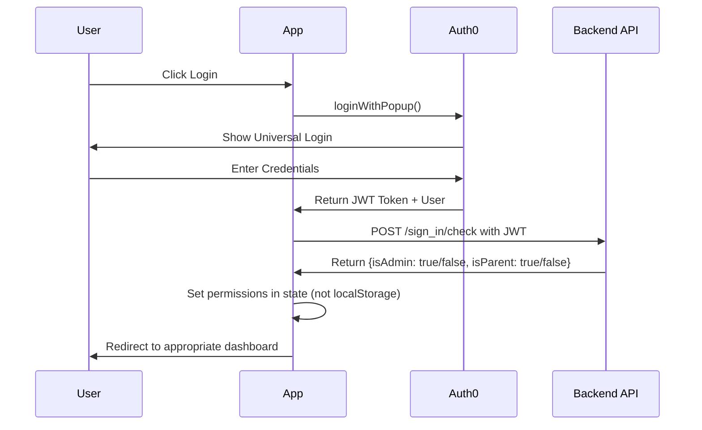
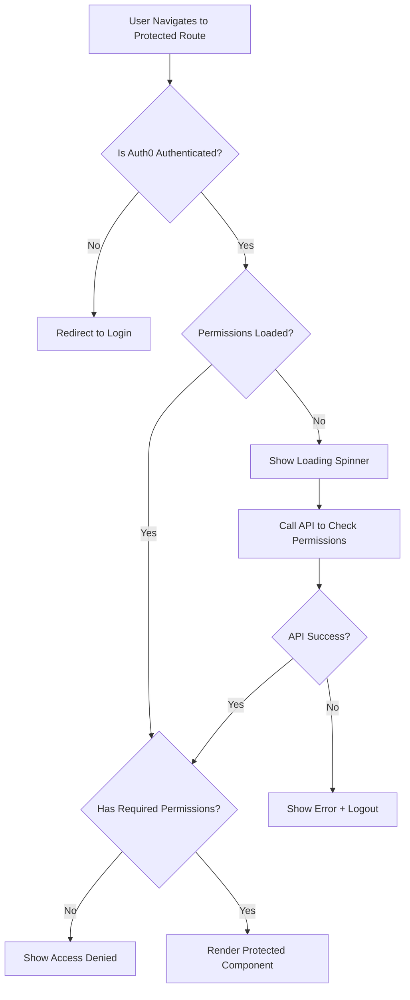

# Auth0-Only Authentication Architecture

## Executive Summary

This document outlines a complete redesign of the authentication system to use **Auth0 exclusively**, eliminating all security vulnerabilities in the current mixed authentication approach.

## Current System Problems

### 🚨 Critical Security Issues
1. **Mixed Authentication**: Legacy SHA256 passwords with Auth0 creates confusion and attack vectors
2. **Client-Side Authorization**: Permission decisions made via localStorage are easily manipulated
3. **Token Exposure**: JWT tokens logged to console in multiple places
4. **Insecure Storage**: Critical auth data stored in localStorage instead of secure Auth0 state
5. **Inconsistent Flows**: Multiple authentication paths with different security models

### 🔧 Current Technical Debt
- `/src/utils/auth.js` - Mixed localStorage/Auth0 logic
- `/src/hooks/useAuth.js` - Complex fallback mechanisms
- `/src/components/PrivateRoute.jsx` - Client-side permission checking
- Multiple API endpoints with different auth patterns

## New Architecture Overview

### Core Principles
1. **Auth0-Only**: No custom authentication logic
2. **Server-Side Authorization**: All permission decisions on backend
3. **Zero Client Storage**: No auth data in localStorage/sessionStorage
4. **Single Source of Truth**: Auth0 state only
5. **Clean Separation**: Authentication vs Authorization clearly separated

## Architecture Components

### 1. Enhanced Auth Context/Provider

```jsx
// /src/auth/AuthProvider.jsx
import React, { createContext, useContext, useEffect, useState } from 'react';
import { useAuth0 } from '@auth0/auth0-react';
import { authService } from './AuthService';

const AuthContext = createContext();

export const AuthProvider = ({ children }) => {
  const auth0 = useAuth0();
  const [permissions, setPermissions] = useState(null);
  const [isLoadingPermissions, setIsLoadingPermissions] = useState(true);
  const [error, setError] = useState(null);

  // Core auth state
  const authState = {
    // Auth0 state (read-only)
    isAuthenticated: auth0.isAuthenticated,
    isLoading: auth0.isLoading,
    user: auth0.user,
    
    // Application permissions (server-sourced)
    permissions,
    isLoadingPermissions,
    
    // User roles (derived from permissions)
    isAdmin: permissions?.isAdmin === true,
    isParent: permissions?.isParent === true,
    hasAccess: permissions?.isAdmin === true || permissions?.isParent === true,
    
    // Error state
    error
  };

  // Auth operations
  const authOperations = {
    login: () => authService.login(auth0),
    logout: () => authService.logout(auth0, setPermissions),
    refreshPermissions: () => authService.refreshPermissions(auth0, setPermissions, setIsLoadingPermissions, setError)
  };

  return (
    <AuthContext.Provider value={{ ...authState, ...authOperations }}>
      {children}
    </AuthContext.Provider>
  );
};

export const useAuth = () => {
  const context = useContext(AuthContext);
  if (!context) throw new Error('useAuth must be used within AuthProvider');
  return context;
};
```

### 2. Clean Auth Service

```jsx
// /src/auth/AuthService.js
class AuthService {
  constructor() {
    this.apiClient = new SecureAPIClient();
  }

  async login(auth0) {
    try {
      await auth0.loginWithPopup({
        authorizationParams: {
          prompt: 'login'
        }
      });
    } catch (error) {
      if (error.error !== 'popup_closed_by_user') {
        throw new Error('Login failed. Please try again.');
      }
    }
  }

  async logout(auth0, setPermissions) {
    try {
      // Clear application state
      setPermissions(null);
      
      // Auth0 logout (secure)
      await auth0.logout({
        logoutParams: { 
          returnTo: window.location.origin + '/login' 
        }
      });
    } catch (error) {
      console.error('Logout error:', error);
      // Force redirect on logout failure
      window.location.href = '/login';
    }
  }

  async refreshPermissions(auth0, setPermissions, setIsLoadingPermissions, setError) {
    if (!auth0.isAuthenticated || !auth0.user?.email) {
      setPermissions(null);
      setIsLoadingPermissions(false);
      return;
    }

    setIsLoadingPermissions(true);
    setError(null);

    try {
      const permissions = await this.apiClient.checkPermissions(auth0.user.email, auth0.getAccessTokenSilently);
      
      if (permissions.isAdmin === true || permissions.isParent === true) {
        setPermissions(permissions);
      } else {
        setError('Access denied - insufficient permissions');
        await this.logout(auth0, setPermissions);
      }
    } catch (error) {
      setError('Failed to verify permissions');
      console.error('Permission check failed:', error);
    } finally {
      setIsLoadingPermissions(false);
    }
  }
}

export const authService = new AuthService();
```

### 3. Secure API Client

```jsx
// /src/api/SecureAPIClient.js
import { api_base_url, school_id } from '../utils/const';

export class SecureAPIClient {
  async getSecureHeaders(getAccessTokenSilently) {
    try {
      const token = await getAccessTokenSilently();
      return {
        'Content-Type': 'application/json',
        'Authorization': `Bearer ${token}`
      };
    } catch (error) {
      throw new Error('Authentication required - please login again');
    }
  }

  async checkPermissions(email, getAccessTokenSilently) {
    const headers = await this.getSecureHeaders(getAccessTokenSilently);
    
    const response = await fetch(`${api_base_url}/sign_in/check/${school_id}`, {
      method: 'POST',
      headers,
      body: JSON.stringify({
        email: email.toLowerCase(),
        auth0_user: true
      })
    });

    if (!response.ok) {
      if (response.status === 404) {
        throw new Error('User not found in system');
      }
      throw new Error('Permission check failed');
    }

    return response.json();
  }

  async makeAuthenticatedRequest(endpoint, options = {}, getAccessTokenSilently) {
    const headers = await this.getSecureHeaders(getAccessTokenSilently);
    
    return fetch(endpoint, {
      ...options,
      headers: {
        ...headers,
        ...options.headers
      }
    });
  }
}
```

### 4. Permission Hook

```jsx
// /src/hooks/usePermissions.js
import { useAuth } from '../auth/AuthProvider';

export const usePermissions = () => {
  const { permissions, isLoadingPermissions, isAdmin, isParent, hasAccess } = useAuth();

  return {
    // Permission state
    permissions,
    isLoadingPermissions,
    
    // Role checks
    isAdmin,
    isParent,
    hasAccess,
    
    // Permission helpers
    canAccessAdminRoutes: isAdmin,
    canAccessParentRoutes: isParent || isAdmin, // Admins can access parent routes
    
    // Specific permissions (when backend provides granular permissions)
    canViewReports: permissions?.canViewReports === true,
    canEditForms: permissions?.canEditForms === true,
    canManageUsers: permissions?.canManageUsers === true
  };
};
```

### 5. Secure Route Protection

```jsx
// /src/components/SecureRoute.jsx
import React from 'react';
import { Navigate } from 'react-router-dom';
import { useAuth } from '../auth/AuthProvider';
import { LoadingSpinner } from './LoadingSpinner';
import { ErrorBoundary } from './ErrorBoundary';

export const SecureRoute = ({ 
  children, 
  requireAdmin = false, 
  requireParent = false,
  fallbackPath = '/login'
}) => {
  const { 
    isAuthenticated, 
    isLoading, 
    isLoadingPermissions, 
    isAdmin, 
    isParent, 
    hasAccess,
    error 
  } = useAuth();

  // Show loading while Auth0 or permissions are loading
  if (isLoading || isLoadingPermissions) {
    return <LoadingSpinner message="Verifying authentication..." />;
  }

  // Handle authentication errors
  if (error) {
    return (
      <div className="min-h-screen flex items-center justify-center">
        <div className="text-center">
          <h2 className="text-xl font-semibold text-red-600 mb-2">Authentication Error</h2>
          <p className="text-gray-600 mb-4">{error}</p>
          <button 
            onClick={() => window.location.href = '/login'}
            className="px-4 py-2 bg-blue-600 text-white rounded hover:bg-blue-700"
          >
            Login Again
          </button>
        </div>
      </div>
    );
  }

  // Redirect if not authenticated
  if (!isAuthenticated) {
    return <Navigate to={fallbackPath} replace />;
  }

  // Check specific role requirements
  if (requireAdmin && !isAdmin) {
    return (
      <div className="min-h-screen flex items-center justify-center">
        <div className="text-center">
          <h2 className="text-xl font-semibold text-red-600 mb-2">Access Denied</h2>
          <p className="text-gray-600">Administrator privileges required.</p>
        </div>
      </div>
    );
  }

  if (requireParent && !isParent && !isAdmin) {
    return (
      <div className="min-h-screen flex items-center justify-center">
        <div className="text-center">
          <h2 className="text-xl font-semibold text-red-600 mb-2">Access Denied</h2>
          <p className="text-gray-600">Parent or administrator privileges required.</p>
        </div>
      </div>
    );
  }

  // General access check (must be either admin or parent)
  if (!requireAdmin && !requireParent && !hasAccess) {
    return <Navigate to="/unauthorized" replace />;
  }

  // Wrap in error boundary for runtime errors
  return (
    <ErrorBoundary>
      {children}
    </ErrorBoundary>
  );
};
```

## Authentication Flow Diagrams

### Login Flow


### Route Protection Flow


## Security Improvements

### 1. Token Security
- **No Console Logging**: Tokens never logged to console
- **Memory Only**: All auth state in React context, never persisted
- **Automatic Refresh**: Auth0 handles token refresh automatically

### 2. Permission Security
- **Server-Side Only**: All authorization decisions on backend
- **JWT-Based**: Permission checks use Auth0 JWT token
- **No Client Storage**: No permission data in localStorage

### 3. Error Handling
- **Graceful Degradation**: Clear error messages, no app crashes
- **Secure Fallback**: Always redirect to login on auth errors
- **Audit Trail**: Server-side logging of auth events

## API Integration Patterns

### 1. Component Integration
```jsx
// Usage in components
import { useAuth } from '../auth/AuthProvider';
import { usePermissions } from '../hooks/usePermissions';

function AdminComponent() {
  const { user } = useAuth();
  const { canManageUsers } = usePermissions();
  
  if (!canManageUsers) {
    return <AccessDenied />;
  }
  
  return <AdminPanel user={user} />;
}
```

### 2. API Request Pattern
```jsx
// Making authenticated requests
import { useAuth } from '../auth/AuthProvider';
import { apiClient } from '../api/SecureAPIClient';

function useFormData() {
  const auth0 = useAuth0();
  
  const fetchData = async () => {
    const response = await apiClient.makeAuthenticatedRequest(
      '/api/forms',
      { method: 'GET' },
      auth0.getAccessTokenSilently
    );
    return response.json();
  };
  
  return { fetchData };
}
```

## Migration Strategy

### Phase 1: Preparation (1-2 days)
1. Create new auth components (AuthProvider, SecureRoute, AuthService)
2. Add error boundaries and loading components
3. Create migration utility to clear existing localStorage auth data

### Phase 2: Core Migration (2-3 days)
1. Replace current Auth0Provider with new AuthProvider
2. Update all routes to use SecureRoute instead of PrivateRoute
3. Remove all localStorage auth logic from utils/auth.js

### Phase 3: Component Updates (3-4 days)
1. Update all components to use useAuth and usePermissions hooks
2. Replace all localStorage.getItem calls with permission hooks
3. Update API calls to use SecureAPIClient

### Phase 4: Cleanup (1-2 days)
1. Remove legacy authentication files
2. Remove console.log statements exposing tokens
3. Add comprehensive error handling
4. Update tests

### Phase 5: Validation (1-2 days)
1. End-to-end testing of all auth flows
2. Security review of token handling
3. Performance testing of permission checks
4. User acceptance testing

## File Structure Changes

```
src/
├── auth/
│   ├── AuthProvider.jsx          [NEW] - Main auth context
│   ├── AuthService.js           [NEW] - Auth operations
│   └── Auth0Provider.jsx        [KEEP] - Auth0 wrapper
├── api/
│   └── SecureAPIClient.js       [NEW] - Secure API client
├── components/
│   ├── SecureRoute.jsx          [NEW] - Route protection
│   ├── LoadingSpinner.jsx       [NEW] - Loading states
│   ├── ErrorBoundary.jsx        [NEW] - Error handling
│   └── PrivateRoute.jsx         [REMOVE] - Legacy component
├── hooks/
│   ├── usePermissions.js        [NEW] - Permission hook
│   └── useAuth.js              [REMOVE] - Legacy hook
└── utils/
    ├── auth.js                 [REMOVE] - Legacy utils
    └── authentication.js       [REMOVE] - Legacy utils
```

## Testing Strategy

### Unit Tests
- AuthProvider state management
- AuthService operations
- usePermissions hook logic
- SecureRoute permission checks

### Integration Tests
- Login/logout flows
- Route protection scenarios
- API client with token handling
- Error boundary behavior

### Security Tests
- Token exposure verification
- LocalStorage cleanup validation
- Permission bypass attempts
- Error state security

## Performance Considerations

### Optimizations
1. **Permission Caching**: Cache permissions in memory for session duration
2. **Token Refresh**: Auth0 handles token refresh automatically
3. **Lazy Loading**: Load permissions only when needed
4. **Error Recovery**: Graceful handling without full page reload

### Monitoring
1. **Auth Metrics**: Login success rate, token refresh failures
2. **Permission Checks**: API response times, cache hit rates
3. **Error Tracking**: Auth errors, permission denials
4. **User Experience**: Loading times, redirect delays

## Conclusion

This Auth0-only architecture provides:

✅ **Complete Security**: No client-side auth decisions, no token exposure
✅ **Clean Architecture**: Clear separation of concerns
✅ **Maintainable Code**: Single source of truth, consistent patterns
✅ **Better UX**: Proper loading states, error handling
✅ **Scalable**: Easy to add new permissions and roles

The migration eliminates all current security vulnerabilities while providing a foundation for future authentication features.