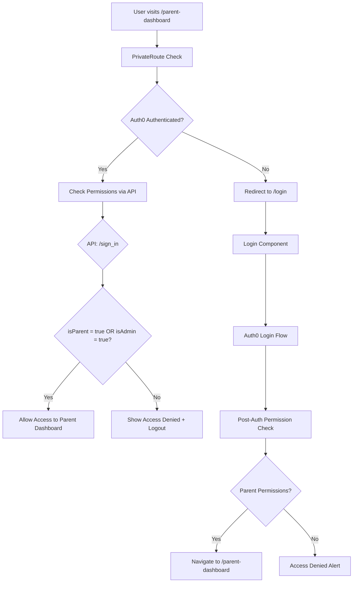

# React Authentication Code Structure Analysis

**Analysis Date:** September 6, 2025  
**Scope:** Complete authentication system for parent login functionality  
**Focus:** Code structure, authentication flow, and potential issues with parent login

## Executive Summary

The React application uses a hybrid authentication system combining Auth0 for secure authentication with custom API-based permission checks. The system has undergone significant refactoring with both legacy and modern authentication patterns coexisting. The recently modified PrivateRoute component shows improvements in authentication flow handling.

## 🏗️ Authentication Architecture

### Core Components

#### 1. Authentication Providers
- **Auth0Provider** (`/src/auth/Auth0Provider.jsx`)
  - Primary authentication provider using Auth0
  - Configured for web application flow
  - Uses localStorage for token caching
  - Handles redirect callbacks properly

#### 2. Route Protection
- **PrivateRoute** (`/src/components/PrivateRoute.jsx`) - **RECENTLY MODIFIED** ⚠️
  - Primary route protection component
  - Dual authentication check (Auth0 + API permissions)
  - Recent improvements in authentication flow prioritization
  - Supports role-based access (admin/parent)

- **ProtectedRoute** (`/src/components/ProtectedRoute.tsx`)
  - Alternative route protection (appears to be simplified/test version)
  - Currently bypasses permission checks (temporary)

#### 3. Login Components
- **Login** (`/src/components/Login.jsx`)
  - Primary Auth0-based login component
  - Handles both login and signup flows
  - Includes permission verification after auth
  - Supports fallback error handling

- **LoginNew** (`/src/components/LoginNew.jsx`)
  - Modern login component with enhanced UX
  - Dual-mode: Auth0 (preferred) + legacy password
  - Deprecated password login for security
  - Form validation with Zod schema

### Authentication Hooks

#### 1. useAuth Hook (`/src/hooks/useAuth.js`)
- Wraps Auth0 functionality
- **Advanced localStorage/cookie clearing logic**
- Comprehensive Auth0 key preservation
- Safe storage management

#### 2. useAuthState Hook (`/src/hooks/useAuthState.js`)
- Manages authentication state
- API-based permission checking
- Concurrent request prevention

#### 3. usePermissions Hook (`/src/hooks/usePermissions.ts`)
- Role-based permission management
- Resource-specific access control

## 🔐 Parent Login Flow Analysis

### Current Parent Authentication Flow



### Key Authentication Files for Parents

1. **Route Configuration** (`/src/App.jsx`)
   ```jsx
   <Route path="/parent-dashboard" element={
     <ProtectedRoute requireParent={true}>
       <ParentDashboard />
     </ProtectedRoute>
   } />
   ```

2. **Parent Dashboard** (`/src/parentComponent/ParentDashboardRefactored.jsx`)
   - Uses `useAuth()` and `usePermissions()` hooks
   - Supports admin impersonation via URL params
   - Dual permission check: `isParent || isAdmin`

## 🚨 Recent Changes & Issues Identified

### PrivateRoute Component Modifications

**Recent Change** (from git diff):
```jsx
// ADDED: Prioritize authentication check
if (!isLoading && !isAuthenticated) {
  console.log('🚫 User not authenticated, redirecting to login');
  return <Navigate to="/login" replace />;
}

// CHANGED: Separated authentication from permission checks
if (invalidUser) { // Previously: if (!isAuthenticated || invalidUser)
  return <Navigate to="/login" replace />;
}
```

**Impact:** This change improves the authentication flow by:
- Preventing permission checks on unauthenticated users
- Reducing race conditions
- Cleaner separation of concerns

### Critical Issues Found

#### 1. **Dual Route Protection Systems**
- Two different ProtectedRoute components exist
- One is fully functional (PrivateRoute.jsx)
- One bypasses permissions (ProtectedRoute.tsx) - potentially for testing

#### 2. **Permission Check API Complexity**
- Multiple fallback mechanisms in PrivateRoute
- Primary: `GET /sign_in` with Auth0 user flag
- Fallback: `POST /sign_in/check/{school_id}` with empty password
- Risk of API inconsistencies affecting parent access

#### 3. **Parent-Specific Authentication Issues**

**Issue 1: Multiple Email Resolution**
```jsx
// In ParentDashboardRefactored.jsx
const urlParams = new URLSearchParams(window.location.search);
const urlEmail = urlParams.get('id');
const email = urlEmail || user?.email; // Admin impersonation support
```

**Issue 2: Permission Validation Complexity**
```jsx
// Complex permission checking in PrivateRoute
if (data.isAdmin === true || data.isParent === true) {
  setPermissions(data);
} else {
  // User logout and access denial
  setInvalidUser(true);
  alert('Access Denied: Your account does not have the necessary permissions...');
}
```

#### 4. **Legacy Code Security Concerns**

The codebase contains deprecated authentication utilities:
```javascript
// /src/utils/login.js - DEPRECATED with security warnings
export const loginFunction = () => {
  throw new Error(`SECURITY: loginFunction() has been deprecated due to vulnerabilities.`);
};
```

## 📊 Authentication Service Architecture

### AuthService (`/src/services/authService.js`)
- Provides standardized permission checking
- Currently returns mock permissions (TODO: implement real API)
- Includes permission validation utilities

### API Integration
- **Base URL:** Configured via environment variables
- **Primary Endpoint:** `${api_base_url}/sign_in`
- **Fallback Endpoint:** `${api_base_url}/sign_in/check/${school_id}`
- **Authentication:** Auth0 Bearer tokens

## 🔍 Potential Parent Login Issues

### 1. **Authentication Race Conditions**
- Multiple concurrent permission checks possible
- Fixed partially by `authProcessedRef` in Login components
- `permissionCheckedRef` in PrivateRoute prevents duplicates

### 2. **Error Handling for Parents**
- Aggressive logout on permission failures
- May cause login loops for users with temporary API issues
- Alert-based error messaging (not ideal UX)

### 3. **Admin Impersonation Complexity**
- URL parameter-based email override for admin users
- Potential security concern if not properly validated server-side

### 4. **Permission API Reliability**
- Dual fallback system suggests API reliability issues
- Empty password fallback could be a security risk
- No retry limits on permission checks

## ✅ Positive Security Implementations

### 1. **Auth0 Integration**
- Secure, industry-standard authentication
- Proper token management
- Refresh token support

### 2. **Comprehensive Storage Management**
- Safe localStorage/sessionStorage clearing
- Auth0 key preservation logic
- Cookie management with Auth0 protection

### 3. **Permission-Based Access Control**
- Role-based route protection
- Server-side permission verification
- Admin override capabilities

### 4. **Error Boundary Implementation**
- Comprehensive error handling
- Fallback UI components
- User-friendly error messages

## 🚀 Recommendations for Parent Login

### Immediate Actions Required

1. **Resolve Dual Route Protection**
   ```jsx
   // Remove or clarify the purpose of ProtectedRoute.tsx
   // Ensure consistent use of PrivateRoute.jsx
   ```

2. **Implement Permission API Retry Logic**
   ```jsx
   // Add exponential backoff for permission checks
   // Remove empty password fallback (security risk)
   ```

3. **Improve Parent Error Handling**
   ```jsx
   // Replace alerts with toast notifications
   // Add specific error messages for parents
   // Implement graceful degradation
   ```

### Long-term Improvements

1. **Centralize Authentication Logic**
   - Create unified authentication context
   - Standardize permission checking across components
   - Remove legacy code completely

2. **Enhanced Parent Experience**
   - Add loading states for better UX
   - Implement proper error recovery
   - Add session timeout handling

3. **Security Hardening**
   - Validate admin impersonation server-side
   - Implement proper audit logging
   - Add rate limiting for permission checks

## 📁 File Structure Summary

```
Authentication Files:
├── /src/auth/Auth0Provider.jsx          # Auth0 configuration
├── /src/components/
│   ├── Login.jsx                       # Primary login component
│   ├── LoginNew.jsx                    # Modern login with dual modes
│   ├── PrivateRoute.jsx               # Main route protection ⚠️ MODIFIED
│   └── ProtectedRoute.jsx              # Alternative protection (simplified)
├── /src/hooks/
│   ├── useAuth.js                      # Auth0 wrapper with storage management
│   ├── useAuthState.js                 # Authentication state management
│   └── usePermissions.ts               # Permission checking
├── /src/services/
│   └── authService.js                  # Authentication utilities
└── /src/utils/
    └── login.js                        # Legacy (deprecated) - security warnings
```

## 🎯 Conclusion

The authentication system shows a well-architected Auth0 integration with comprehensive permission checking. Recent improvements to PrivateRoute demonstrate ongoing refinement. However, parent login functionality faces potential issues from dual route protection systems, complex permission API fallbacks, and aggressive error handling.

**Priority:** Focus on consolidating route protection and improving parent-specific error handling to ensure reliable access to parent dashboard functionality.