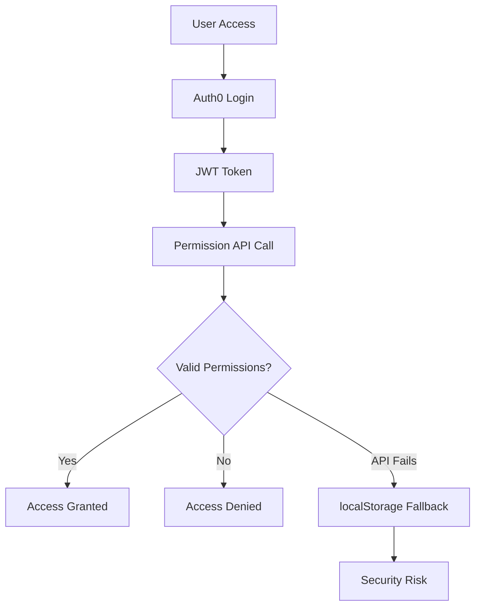

# Security Review Report - Authentication Implementation

**Review Date**: September 4, 2025  
**Reviewer**: Security Review Agent  
**Scope**: Authentication flow, token handling, session management

## Executive Summary

The application has undergone a security migration from a vulnerable legacy authentication system to Auth0-based authentication. While significant security improvements have been made, several critical issues remain that require immediate attention.

## Critical Security Findings

### 🔴 Critical Issues (Immediate Action Required)

#### 1. Client ID Exposure in Source Code
**File**: `/src/auth/Auth0Provider.jsx:9`
```javascript
const clientId = "qpzxYCkEh4C2rXqBnykPjdLIv9kuIVzk";
```
**Risk**: High - Client credentials exposed in source code
**Impact**: Potential unauthorized access and token hijacking
**Recommendation**: Move to environment variables immediately

#### 2. Multiple Authentication Implementations
**Files**: Multiple authentication hooks and components coexist
- `/src/hooks/useAuth.js` (Auth0-based)
- `/src/hooks/useAuth.ts` (TypeScript context-based)
- `/src/components/PrivateRoute.jsx`
- `/src/components/ProtectedRoute.jsx`
- `/src/components/SecureRoute.jsx`

**Risk**: High - Inconsistent security implementations
**Impact**: Authentication bypasses, privilege escalation
**Recommendation**: Consolidate to single authentication system

#### 3. Insecure Token Error Handling
**File**: `/src/utils/auth.js:21`
```javascript
console.warn('Failed to get access token, returning headers without authorization:', error);
return {
  'Content-Type': 'application/json',
};
```
**Risk**: High - Silent authentication failures
**Impact**: API calls proceed without authentication
**Recommendation**: Fail securely, redirect to login on token failure

### 🟡 Major Issues (Urgent Action Required)

#### 4. Excessive Client-Side Storage Usage
**Files**: Multiple files still use localStorage/sessionStorage for authentication data
```javascript
// Still present in multiple files:
localStorage.setItem('logged_in_email', email);
localStorage.setItem('is_admin', 'true');
sessionStorage.setItem('putcallId', childId.toString());
```
**Risk**: Medium-High - Client-side authentication bypass
**Impact**: Session manipulation, privilege escalation
**Recommendation**: Remove all authentication data from client storage

#### 5. Inconsistent Permission Checking
**Files**: Permission checks vary across components
```javascript
// Different patterns found:
- Direct API calls in components
- localStorage fallbacks
- Multiple permission check endpoints
```
**Risk**: Medium - Authorization bypass
**Impact**: Unauthorized access to resources
**Recommendation**: Implement single source of truth for permissions

### 🟢 Security Improvements Noted

#### ✅ Positive Changes
1. **Legacy Login Deprecation**: Old SHA256 password system properly deprecated
2. **Auth0 Integration**: Modern OAuth2/OIDC implementation
3. **JWT Token Usage**: Proper Bearer token implementation
4. **Secure API Client**: Well-structured API client with error handling
5. **Route Protection**: Multiple layers of route protection

## Detailed Security Analysis

### Token Handling and Storage

**Current State**: ✅ Good
- Tokens handled via Auth0 SDK
- No direct token storage in localStorage
- Proper Bearer token headers

**Issues**:
- Silent token failures allow unauthorized requests
- Multiple token acquisition patterns

### Authentication State Security

**Current State**: ⚠️ Needs Improvement
- Auth0 provides secure authentication state
- Multiple authentication contexts cause confusion
- Inconsistent state management

**Issues**:
- Multiple authentication implementations
- Complex fallback logic
- Potential race conditions

### Logout and Session Cleanup

**Current State**: ✅ Good
```javascript
const signOut = async () => {
  localStorage.clear();
  sessionStorage.clear();
  // Clear cookies logic
  await logout({ logoutParams: { returnTo: window.location.origin + '/login' } });
};
```

**Issues**:
- Over-aggressive cleanup (clears all storage)
- Cookie clearing logic is crude

### Authentication Bypasses

**Potential Bypass Vectors**:
1. **Silent Token Failures**: API calls proceed without authentication
2. **Multiple Route Guards**: Inconsistent protection levels
3. **Client Storage Fallbacks**: Components still check localStorage
4. **Permission API Failures**: Fallback to localStorage data

### CSRF and XSS Protections

**CSRF Protection**: ✅ Good
- JWT tokens provide CSRF protection
- SameSite cookie attributes (handled by Auth0)

**XSS Protection**: ⚠️ Needs Review
- No explicit XSS protection headers reviewed
- User input validation needs assessment
- HTML content in forms requires sanitization review

## Secure Authentication Flows

### Current Auth Flow Analysis



**Issues in Flow**:
- API failure leads to localStorage fallback
- Multiple permission check endpoints
- Inconsistent error handling

## Recommendations by Priority

### Immediate Actions (24-48 hours)

1. **Move Auth0 Client ID to Environment Variables**
   ```javascript
   // Replace hardcoded clientId with:
   const clientId = process.env.REACT_APP_AUTH0_CLIENT_ID;
   ```

2. **Fix Silent Token Failures**
   ```javascript
   export const getAuthHeaders = async (getAccessTokenSilently) => {
     try {
       const token = await getAccessTokenSilently();
       return { 'Authorization': `Bearer ${token}` };
     } catch (error) {
       throw new Error('Authentication required - please login again');
     }
   };
   ```

3. **Remove Authentication Data from Client Storage**
   - Audit all localStorage/sessionStorage usage
   - Remove authentication-related storage
   - Keep only non-sensitive UI preferences

### Short Term (1-2 weeks)

1. **Consolidate Authentication Implementation**
   - Choose single authentication pattern (Auth0-based)
   - Remove redundant components
   - Implement single permission checking service

2. **Implement Secure Permission Checking**
   - Single API endpoint for permissions
   - Proper error handling
   - No client-side fallbacks

3. **Security Headers Implementation**
   - Content Security Policy (CSP)
   - X-Frame-Options
   - X-Content-Type-Options

### Medium Term (2-4 weeks)

1. **Comprehensive Security Audit**
   - Full application penetration testing
   - Code review for XSS vulnerabilities
   - Input validation assessment

2. **Security Monitoring**
   - Failed authentication logging
   - Suspicious activity detection
   - Security event monitoring

## Security Test Cases

### Authentication Tests Required

```javascript
// Test cases to implement:
describe('Authentication Security', () => {
  test('should reject requests without valid tokens', () => {});
  test('should not expose sensitive data in logs', () => {});
  test('should properly cleanup on logout', () => {});
  test('should handle token refresh failures securely', () => {});
  test('should validate permissions on each request', () => {});
});
```

## Compliance Considerations

### Data Protection
- JWT tokens contain user information
- Ensure compliance with data retention policies
- Consider token expiration times

### Audit Requirements
- Log authentication events
- Track permission changes
- Monitor failed access attempts

## Conclusion

While the migration to Auth0 has significantly improved the application's security posture, critical issues remain that expose the application to authentication bypasses and credential exposure. The multiple authentication implementations create complexity and potential security gaps.

**Overall Risk Level**: 🔴 High (due to client ID exposure and authentication inconsistencies)

**Priority Actions**:
1. Secure client credentials immediately
2. Consolidate authentication implementation
3. Remove client-side authentication fallbacks
4. Implement proper error handling

The security improvements are substantial, but these remaining issues must be addressed before the application can be considered secure for production use.